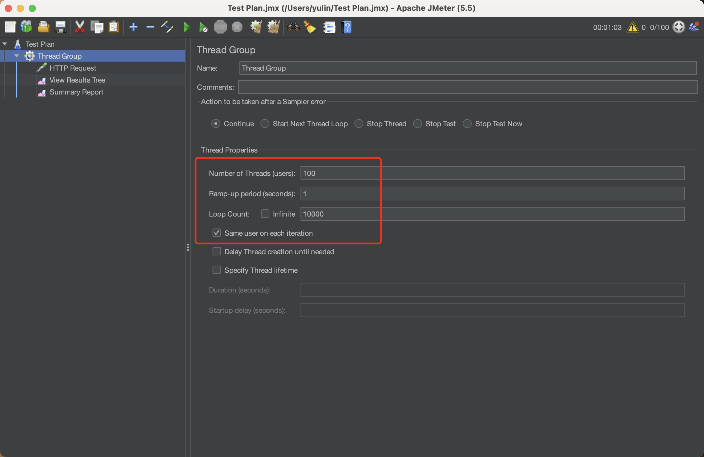

# im-instance

## 项目描述

字学镜像计划 2022 9-10 月场【后端】如果有一千万个人抢票怎么办？

[描述文档地址](https://bytedancecampus1.feishu.cn/docx/doxcnmevBUDWUE9egG6pSBaoVKf)

## 项目介绍

### 关于题目

我有和另外一个提交了的同学讨论过计算并发量的具体方式，有由于题目的一个问题：题目里面没有说明每一档`同时抢票人数`应该对应的票数是多少，如果票数特别少且使用了`redis`作为缓存的话，那么在一分钟内的绝大部分时间其实都没有进行数据库有关的操作，导致一开始处理清酒的速度比较慢，但是票一旦卖完处理请求的速度就会飙升。所以这个票数的设置，我最终选择了`同时抢票人数的66%`

硬件信息：MacBook Air M2 2022，16 GB 内存

### 技术栈

使用的编程语言为 go，数据库为 mysql，中间件有 redis，rabbitmq

压测软件为 jmeter

### 接口说明

-   `GET` `/getTicketNum` 获取当前剩余票数
-   `GET` `/sellTicket?uid={uid}` 根据 uid 参数卖出一张票

### 解决思路

-   首先需要在 mysql 中创建数据库，然后根据定义好的表用项目中`/test/create_tables.go`创建表
-   在表`tickets`中创建数据，可以用项目中`/test/generate_tickets.go`自动生成数据，变量`ticketNum`代表需要生成的票的数量

    `ticket`表字段如下：

    -   `id`，`created_at`，`updated_at`，`deleted_at`为`gorm.model`自动携带的字段；
    -   `status`表示票的状态，0 为在售，1 为已售；
    -   `details`为一张票的描述信息
        

-   项目开始运行时，会将所有的票`id`以集合（set）的方式存入 redis，此过程会花费一定的时间
-   `/getTicketNum`直接从 redis 用 scard() 方法获取集合内元素的数量
-   `/sellTicket?uid={uid}`会随机从 redis 的集合中获取一张票（如果需要，也可以取出指定的票），根据票的`id`和参数`uid`向消息队列发送一条消息将要向表`user2ticket`中插入一条数据，根据`id`向另外一个消息队列发送一条消息将对应票的`status`修改为 1（代表已售）

    `user2ticket`表字段如下：

    -   `id`，`created_at`，`updated_at`，`deleted_at`为`gorm.model`自动携带的字段；
    -   `user_id`为请求中携带的`uid`参数
    -   `ticket_id`为对应票的`id`
        

-   两个消息队列分别接收到一定数量的消息之后批量向数据库写入

### 压测数据

设置票数为 1e6

jmeter 设置 100 个线程（线程太多 jmeter 会爆内存不足），每个线程发送 10000 个请求

最终在 1 分 3 秒内发送了 1e6 个买票的请求卖出了 1e6 张票

统计表`user2ticket`中记录的条数也是 1e6

如果把票的数量设置的更少，我的并发量就会更高，但是这样的数据没什么意义，就直接把票数设置为请求数量了

## 其他

代码写的稀烂，测试都是不规范的，之后有时间会完善。

我本来报名的是另外一个题目：[【前端】什么？网页上也能在线聊天？](https://github.com/yulinJoseph/ByteDanceMirrorPlanFrontend)（已完成）

当时看到题目说后端的服务器可以接入三方服务，就想在开始学 go 的同时全部自己写前端和后端，实现一个聊天服务，但是发现工作量有一点多，想先放一会试一下另外一个纯后端的题目，所以**开始时间**大概可以是 12 月 23 日报名的时间
